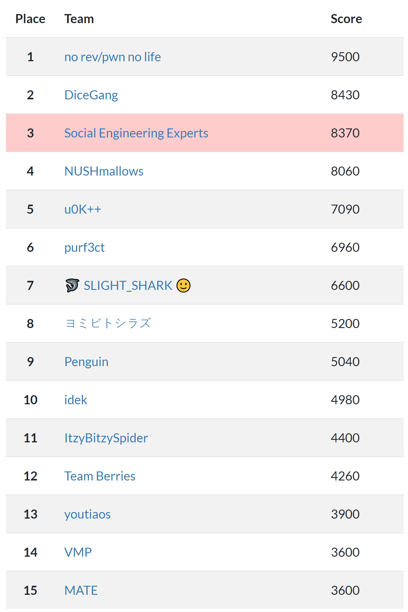
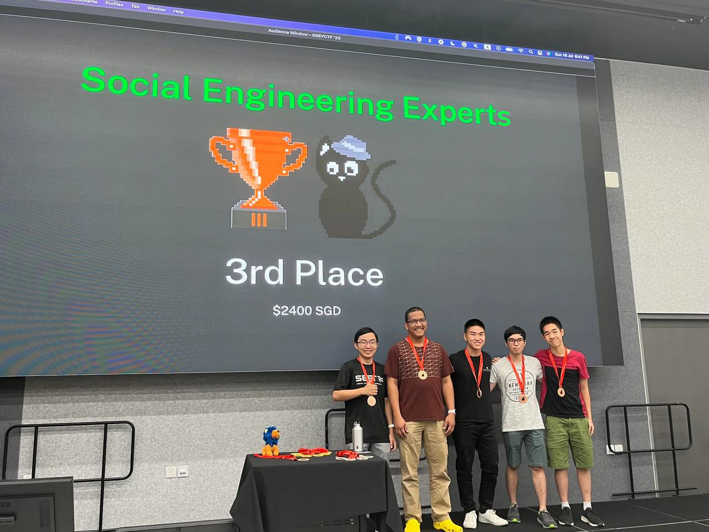
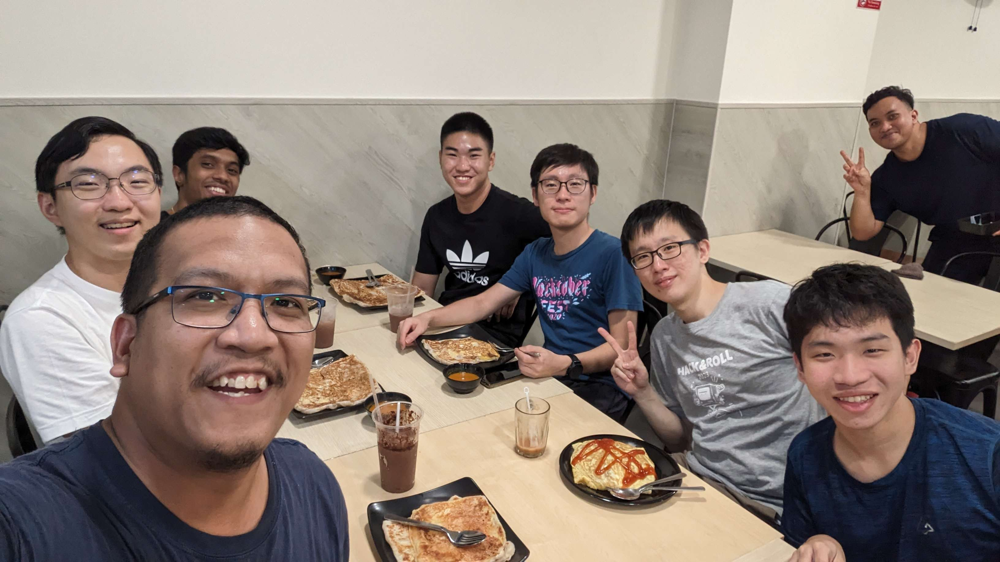
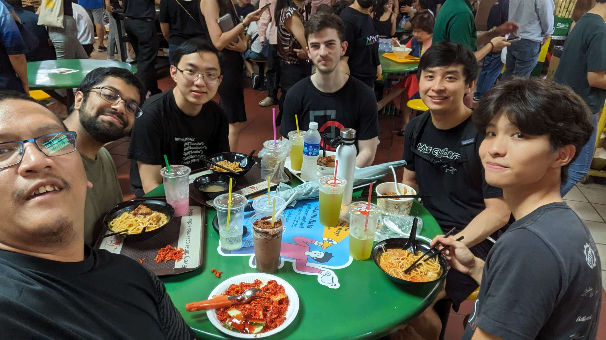
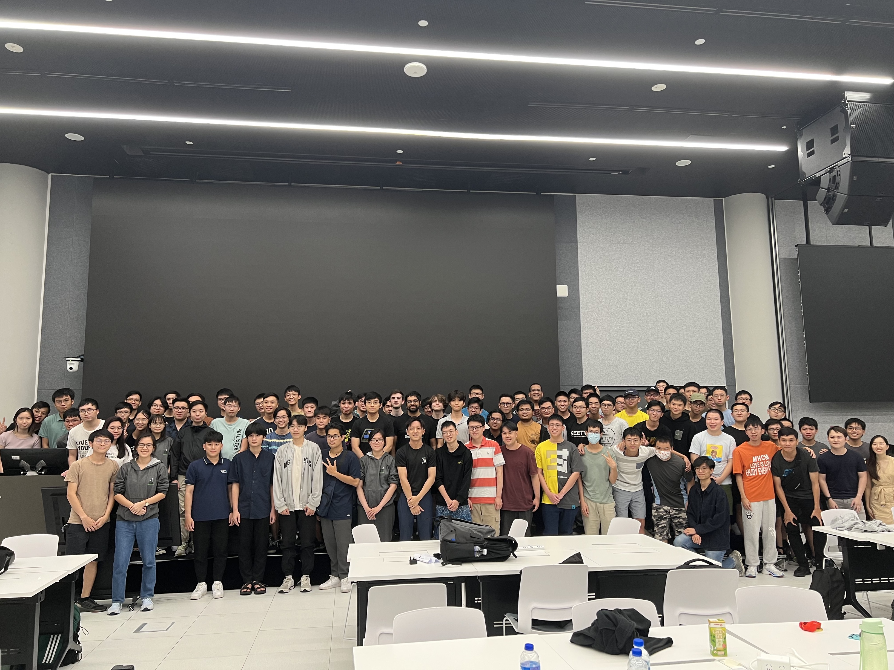

# GreyCTF 2023

This was one of the best events I've attended of any sort, so I thought it deserved its own writeup. I speak of course, of Grey Cat The Flag 2023. It's an annual CTF organised by NUS Greyhats, though I believe this is the first time they are inviting international teams over to Singapore for the finals.

So let's begin with the qualifiers. This was a 48-hour CTF held online in May, where the top 5 international teams and top 10 Singaporean teams were invited to play in the finals. I played with my team Social Engineering Experts and we topped the Singaporean leaderboard, guaranteeing us a spot in the final. I wrote up about the qualifier challenges in [a different notebook](quals_crypto_writeups.ipynb), but the crypto was generally on the easier side, and my solve scripts were typically no longer than a dozen lines each.

Fast-forward to the weekend of 15th-16th July, and the finals were up and running! The competition itself was split into two eight-hour sessions (10am-6pm on Saturday and Sunday), so that we could actually get some proper rest in between. And squeeze in some tourism, if that's your thing.

We finished in third place overall, and took home some S$2400 in prizes, plus a lot of swag!

Final Scoreboard | Prize Ceremony
- | - 
 | 

But of course the real prize were the friends we made along the way.

Food | More food
- | -
 | 

## Challenges

Anyway, I solved a total of nine challenges over the two days. These are:

### Crypto Day 1
- [Baby Feistel](baby_feistel/solve.ipynb) (300 points / 11 solves)
- [Iterated Polynomials](iterated_polynomials/solve.ipynb) (460 points / 3 solves) 🩸
- [Smart](smart/solve.ipynb) (480 points / 2 solves) -- ❌ I didn't actually solve this

### Crypto Day 2
- [AES confusion](aes_confusion/solve.ipynb) (320 points / 10 solves)
- [OTP](otp/solve.md) (220 points / 15 solves)
- [OTP2](otp2/solve.ipynb) (400 points / 6 solves) 🩸
- [POTP](potp/solve.ipynb) (400 points / 6 solves) 🩸

### Misc (Days 1 and 2)
- [actualbeepboop](actualbeepboop/solve.ipynb) (480 points / 2 solves) 🥈
- [Musical Talent](musical_talent/solve.ipynb) (400 points / 6 solves) 🥉
- [Game](game/solve.md) (220 points / 15 solves)
- StackVM -- ❌ I didn't actually solve this, but this is a placeholder because I want to write up on this in the future